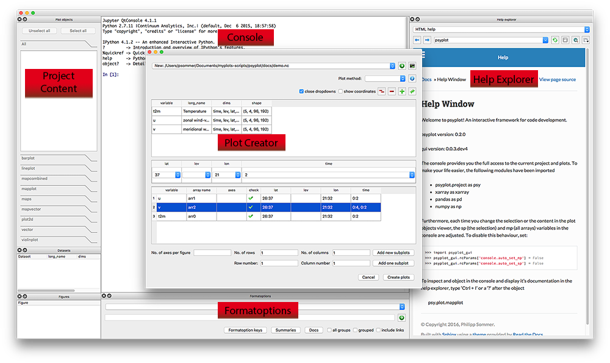

.. _getting-started:

Getting started
===============

The Screenshot above shows you the essential parts of the GUI:

- :ref:`console`: An IPython console
- :ref:`help-explorer`: A browser to display help and browse in the internet
- :ref:`plot-creator`: A widget to create new plots and open datasets
- :ref:`project-content`: A widget to interact with the psyplot project
- :ref:`formatoptions`: A widget to update and change formatoptions

Starting the GUI
----------------
Starting the GUI is straight forward but depends on how you installed it. If
you installed it via `conda` or `pip`, just open a terminal (or Command Window
``cmd`` on Windows) and type ``psyplot``. If you installed it through the
standalone-installers (see :ref:`psyplot:install-standalone`) and decided to
add the binaries to your ``PATH`` variable (the default setting), just type
``psyplot`` in the terminal/cmd.

Otherwise, on MacOSX, look for the `Psyplot` app, e.g. via spotlight, and on 
Windows look in the  :menuselection:`Start --> All Programs --> Psyplot`
directory in your Windows start menu.

.. _console:

The Console
-----------
The central widget in the GUI is an in-process IPython_ console that provides
the possibility to communicate with the psyplot package via the command line
and to load any other module or to run any other script.

It is based on the qtconsole module and it is, by default, connected to the
:ref:`help explorer <help-explorer>`. If you type, for example,

.. code-block:: python

    np.sum(

it will show you the documentation of the :func:`numpy.sum` module in the
:ref:`help explorer <help-explorer>`. The same comes, if you type

.. code-block:: python

    np.sum?

This feature is motivated from the Spyder_ editor and can be disabled via
the rcParams key ``console.connect_to_help`` (see :ref:`configuration`) or the
little |ipython_console| symbol at the top of the help explorer.

Furthermore, is connected to the current psyplot project (see
:func:`psyplot.project.scp` and :func:`psyplot.project.gcp`). Those are

sp
    This variable links to the current subproject (``psy.gcp()``)
mp
    This variable links to the current main project (``psy.gcp(True)``)

The following example, which you can just copy and paste in the console of the
GUI, illustrates this:

.. ipython::

    @suppress
    In [1]: import psyplot.project as psy
       ...: import xarray as xr
       ...: sp = psy.gcp()
       ...: mp = psy.gcp(True)

    # in the beginning, sp and mp are empty
    In [1]: print(sp)
       ...: print(mp)

    In [2]: psy.plot.lineplot(xr.DataArray([1, 2, 3], name='test').to_dataset())

    @suppress
    In [3]: sp = psy.gcp()
       ...: mp = psy.gcp(True)

    # now they both contain this data
    In [3]: print(sp)
       ...: print(mp)

    # lets create a second one
    In [4]: psy.plot.lineplot(xr.DataArray([1, 2, 3], name='test2').to_dataset())

    @suppress
    In [5]: sp = psy.gcp()

    # sp now only contains the new one, mp contains both
    In [5]: print(sp)
       ...: print(mp)

If you do not wish this behaviour, set the ``console.auto_set_mp`` and
``console.auto_set_sp`` rcParams to ``False``.

.. |ipython_console| image:: ipython_console.png

.. _IPython: http://ipython.readthedocs.io/en/stable/
.. _qtconsole: https://qtconsole.readthedocs.io/en/stable/
.. _Spyder: https://pythonhosted.org/spyder/

.. _help-explorer:

The Help Explorer
-----------------
The help explorer provides you access to python objects and online information.
It can be used as a webbrowser if the |world| icon is not clicked or the
``help_explorer.online`` rcParams key is True (see :ref:`configuration`).

It is motivated by the Help of the Spyder_ editor and uses Sphinx to
automatically render python documentation written in restructured Text.

By default, the help explorer uses the ``intersphinx`` extension to link to
different online libraries. This however always consumes time at the startup
and can be disabled by the ``help_explorer.use_intersphinx`` rcParams key.

It is also connected to the information functions of psyplot, e.g. the
:func:`psyplot.plotter.Plotter.show_keys` function. For example

.. ipython::

    In [1]: psyplot.project.plot.lineplot.keys()

would be converted to HTML and shown in the help explorer.

.. _plot-creator:

The Plot Creator
----------------
The plot creator is used to create new plots from a :class:`xarray.Dataset`.
You can open it via :menuselection:`File --> New Plot`.

.. _project-content:

The Project content
-------------------
The project content shows you the current project (see
:func:`psyplot.project.gcp`). The selected arrays are the current subproject.

.. _formatoptions:

The formatoptions widget
------------------------
The formatoption widget can be used to update the formatoptions of the current
subproject or to show their help.
